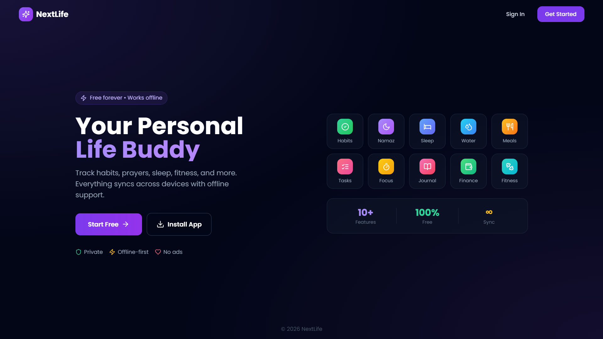

# 🌟 NextLife - Your Personal Life Buddy

<div align="center">



**A beautiful, offline-first personal life management app built with Next.js 14**

[](https://nextjs.org/)
[](https://www.typescriptlang.org/)
[](https://tailwindcss.com/)
[]()

</div>

---

## ✨ Features

### 🎯 Habit Tracking
Track your daily habits with beautiful streak counters, customizable icons, and weekly insights. Build consistency one day at a time.

### 🕌 Prayer/Namaz Tracker
Never miss a prayer with the dedicated 5-time daily prayer tracker. Visual progress and monthly consistency reports.

### 😴 Sleep Logger
Log your sleep patterns, track quality, and visualize your sleep trends over time. Get insights on your rest habits.

### 🍽️ Meal Tracker
Log breakfast, lunch, dinner, and snacks with calorie tracking. Built-in food database for quick logging.

### 💧 Water Intake
Stay hydrated with the water tracker. Quick add buttons, daily goals, and weekly consumption charts.

### 💰 Finance Manager
Track expenses by category, set budgets, and visualize spending patterns. Supports Indian Rupees (₹).

### 💪 Fitness Tracker
Log workouts, track weight, steps, and calories burned. Monitor your fitness journey with detailed stats.

### ✅ Task Manager
Organize your tasks with priorities, due dates, and completion tracking. Simple yet powerful task management.

### 🍅 Pomodoro Timer
Focus better with the built-in Pomodoro timer. Work sessions, short breaks, and long breaks with stats tracking.

### 📔 Journal
Write your thoughts in a beautiful diary-style interface with mood tracking and tags. Your private digital diary.

### 🔐 Vault
Securely store notes, links, and ideas with PIN protection. Your personal knowledge base.

### 📊 Insights
Get comprehensive analytics on your productivity, habits, sleep, water intake, and more. Weekly and monthly reports.

---

## 📸 Screenshots

<!-- Add your screenshots here -->
| Dashboard | Habits | Journal |
|-----------|--------|---------|
|  |  |  |

| Finance | Sleep | Insights |
|---------|-------|----------|
|  |  |  |

---

## 🚀 Tech Stack

- **Framework:** Next.js 14 (App Router)
- **Language:** TypeScript
- **Styling:** Tailwind CSS
- **Database:** Dexie.js (IndexedDB - Offline First)
- **Authentication:** NextAuth.js with Google OAuth
- **State Management:** Zustand
- **UI Components:** Radix UI
- **Icons:** Lucide React
- **Date Handling:** date-fns

---

## 📁 Project Structure

```
src/
├── app/
│   ├── dashboard/
│   │   ├── habits/      # Habit tracking
│   │   ├── prayer/      # Namaz tracker
│   │   ├── sleep/       # Sleep logger
│   │   ├── meals/       # Meal tracker
│   │   ├── water/       # Water intake
│   │   ├── finance/     # Expense manager
│   │   ├── fitness/     # Workout tracker
│   │   ├── tasks/       # Task manager
│   │   ├── pomodoro/    # Focus timer
│   │   ├── journal/     # Digital diary
│   │   ├── vault/       # Secure notes
│   │   ├── insights/    # Analytics
│   │   └── settings/    # App settings
│   ├── login/
│   └── register/
├── components/          # Reusable UI components
├── hooks/              # Custom React hooks
├── lib/
│   ├── db/             # Dexie database schema
│   └── utils.ts        # Utility functions
└── types/              # TypeScript definitions
```

---

## 🎨 Design Philosophy

- **Premium Matte Aesthetic:** Each page has its own unique color theme with subtle gradients
- **Mobile First:** Fully responsive design optimized for mobile devices
- **Dark Mode:** Complete dark mode support throughout the app
- **Offline First:** All data stored locally using IndexedDB - works without internet
- **Privacy Focused:** Your data stays on your device

---

## 📄 License

This project is private and not licensed for public distribution.

---

<div align="center">

**Built with ❤️ by Sameer**

</div>
